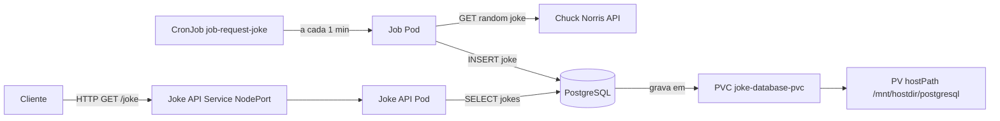

# 06 — Joke API no Kubernetes (kind)

Implantação completa da Joke API com PostgreSQL em um cluster Kubernetes local usando [kind](https://kind.sigs.k8s.io/). Inclui Deployments, Services, PersistentVolume, PersistentVolumeClaim, Namespace e CronJob.

> Parte do curso [Fundamentos](../README.md).

## Arquitetura

```
                        ┌──────────────────────────────────┐
                        │         Namespace: jokeapi        │
                        │                                   │
                        │  ┌───────────────┐               │
                        │  │  joke-api     │ Deployment     │
                        │  │  (FastAPI)    │────────────┐  │
                        │  └───────────────┘            │  │
                        │         │                     │  │
                        │  joke-api-svc (NodePort:8000) │  │
                        │                               │  │
                        │  ┌───────────────┐            │  │
                        │  │ joke-database │ Deployment  │  │
                        │  │  (PostgreSQL) │            │  │
                        │  └──────┬────────┘            │  │
                        │         │ PVC → PV (hostPath)  │  │
                        │  joke-database-svc (ClusterIP)│  │
                        │                               │  │
                        │  ┌───────────────┐            │  │
                        │  │ job-request-  │ CronJob    │  │
                        │  │ joke (1/min)  │────────────┘  │
                        │  └───────────────┘               │
                        └──────────────────────────────────┘
```

### Fluxo

1. O **CronJob** `job-request-joke` dispara a cada minuto, busca uma piada aleatória na [Chuck Norris API](https://api.chucknorris.io/) e a grava no PostgreSQL.
2. A **Joke API** serve as piadas armazenadas no banco via endpoint REST.
3. O PostgreSQL persiste os dados em um **PersistentVolume** montado no `hostPath` dos workers (`/mnt/hostdir`).



## Estrutura

```text
06-kubernetes/
├── docs/
│   └── assets/                  # Imagens da documentacao
│       ├── kubernetes-introduction.png
│       ├── kubernetes-pod-example.png
│       ├── kubernetes-services-overview.png
│       ├── kubernetes-manifests-overview.png
│       └── project-architecture-overview.png
├── cluster/                      # → README.md
│   ├── config.yaml
│   └── create_namespace.yaml
├── api/                          # → README.md
│   ├── api_deployment.yaml
│   ├── api_service.yaml
│   ├── Dockerfile
│   └── src/main.py
├── postgres/                     # → README.md
│   ├── database_deployment.yaml
│   ├── database_pv_pvc.yaml
│   └── database_service.yaml
├── job/                          # → README.md
│   ├── job_request_new_joke.yaml
│   ├── Dockerfile
│   └── src/main.py
├── hostdir/                      # Montado nos workers via kind extraMounts (gitignored)
├── build-images.sh               # Build das imagens locais e carga no cluster kind
├── create-volumes.sh             # Cria o diretório hostdir/postgresql antes de subir o cluster
└── delete-volumes.sh             # Remove o diretório hostdir/postgresql
```

## Fundamentos Kubernetes

- [O que e Kubernetes](docs/assets/kubernetes-introduction.png)
- [Meu primeiro Pod](docs/assets/kubernetes-pod-example.png)
- [Services no Kubernetes](docs/assets/kubernetes-services-overview.png)
- [Manifestos Kubernetes](docs/assets/kubernetes-manifests-overview.png)
- [Arquitetura do projeto](docs/assets/project-architecture-overview.png)

## Pré-requisitos

- [Docker](https://docs.docker.com/get-docker/)
- [kind](https://kind.sigs.k8s.io/docs/user/quick-start/#installation)
- [kubectl](https://kubernetes.io/docs/tasks/tools/)

## Como executar

### 1. Ajustar o path local no config do cluster

Antes de criar o cluster, ajuste o `hostPath` em `cluster/config.yaml` para o caminho local deste projeto na sua maquina.

Exemplo:

```yaml
extraMounts:
    - hostPath: /seu/caminho/06-kubernetes/hostdir
        containerPath: /mnt/hostdir
```

### 2. Criar o diretório de volume

O kind monta o `extraMounts` no momento da criação do cluster, portanto o diretório precisa existir antes:

```bash
./create-volumes.sh
```

### 3. Criar o cluster kind

```bash
kind create cluster --config cluster/config.yaml --name jokeapi-cluster
```

### 4. Fazer o build das imagens e carregá-las no cluster

Kubernetes não executa `docker build`. As imagens precisam ser construídas localmente e injetadas no cluster com `kind load docker-image`:

```bash
./build-images.sh
```

Isso faz o build de `joke-api-python:k8s` e `joke-job-request:k8s`. Os deployments usam `imagePullPolicy: Never`, garantindo que o Kubernetes nunca tente buscar essas imagens na internet.

Para recarregar após alterar o código:

```bash
./build-images.sh
kubectl rollout restart deployment -n jokeapi
```

### 5. Criar o Namespace

```bash
kubectl apply -f cluster/create_namespace.yaml
```

### 6. Criar PersistentVolume e PVC

```bash
kubectl apply -f postgres/database_pv_pvc.yaml
```

### 7. Subir o PostgreSQL

```bash
kubectl apply -f postgres/database_deployment.yaml
kubectl apply -f postgres/database_service.yaml
```

### 8. Subir a API

```bash
kubectl apply -f api/api_deployment.yaml
kubectl apply -f api/api_service.yaml
```

### 9. Criar o CronJob

```bash
kubectl apply -f job/job_request_new_joke.yaml
```

### 10. Verificar os recursos

```bash
kubectl get all -n jokeapi
kubectl get pv,pvc -n jokeapi
```

### 11. Acessar a API

```bash
# Obter a porta NodePort alocada
kubectl get svc joke-api-svc -n jokeapi

# Obter o IP de um worker
kubectl get nodes -o wide

# Fazer uma requisição
curl http://<NODE_IP>:<NODE_PORT>/joke/
```

### Limpar tudo

```bash
kind delete cluster --name jokeapi-cluster
./delete-volumes.sh
```

## Comandos mais usados no Kubernetes

### Contexto e namespace

```bash
# Ver contexto atual do kubectl
kubectl config current-context

# Listar contexts
kubectl config get-contexts

# Definir namespace padrao para o contexto atual
kubectl config set-context --current --namespace=jokeapi
```

### Recursos principais

```bash
# Ver tudo no namespace
kubectl get all -n jokeapi

# Ver pods com mais detalhes
kubectl get pods -n jokeapi -o wide

# Acompanhar mudancas em tempo real
kubectl get pods -n jokeapi -w

# Ver services, deployments e jobs
kubectl get svc,deploy,job,cronjob -n jokeapi
```

### Logs e diagnostico

```bash
# Logs de um deployment (stream)
kubectl logs -f deployment/joke-api -n jokeapi

# Logs do postgres
kubectl logs -f deployment/joke-database -n jokeapi

# Descrever pod (eventos, erros, probes, etc.)
kubectl describe pod <POD_NAME> -n jokeapi

# Ver eventos recentes do namespace
kubectl get events -n jokeapi --sort-by=.metadata.creationTimestamp
```

### Aplicar mudancas

```bash
# Aplicar um manifesto
kubectl apply -f api/api_deployment.yaml

# Reaplicar tudo por pasta
kubectl apply -f api/

# Ver diff antes de aplicar
kubectl diff -f api/
```

### Reinicio e escala

```bash
# Reiniciar rollout da API
kubectl rollout restart deployment/joke-api -n jokeapi

# Ver status do rollout
kubectl rollout status deployment/joke-api -n jokeapi

# Escalar replicas da API
kubectl scale deployment/joke-api --replicas=2 -n jokeapi
```

### Executar comandos dentro do pod

```bash
# Abrir shell em um pod
kubectl exec -it <POD_NAME> -n jokeapi -- sh

# Testar conexao com a API a partir de um pod temporario
kubectl run curltmp --rm -it --restart=Never -n jokeapi --image=curlimages/curl -- \
    curl -s http://joke-api-svc:8000/joke/
```

### Port-forward (acesso local rapido)

```bash
# Expor a API localmente em localhost:8000
kubectl port-forward -n jokeapi svc/joke-api-svc 8000:8000

# Em outro terminal
curl http://127.0.0.1:8000/joke/
```

### Limpeza de recursos

```bash
# Deletar um recurso especifico
kubectl delete -f job/job_request_new_joke.yaml

# Deletar todos os recursos de uma pasta
kubectl delete -f api/

# Deletar namespace inteiro (remove tudo dentro)
kubectl delete namespace jokeapi
```

## Manifests resumidos

| Arquivo | Recurso | Descrição |
|---|---|---|
| `cluster/config.yaml` | Cluster kind | 1 control-plane + 2 workers com hostPath mount |
| `cluster/create_namespace.yaml` | Namespace | `jokeapi` |
| `postgres/database_pv_pvc.yaml` | PV + PVC | 1Gi, `storageClassName: manual`, `ReadWriteMany` |
| `postgres/database_deployment.yaml` | Deployment | PostgreSQL 16, credenciais via env |
| `postgres/database_service.yaml` | Service | ClusterIP, porta 5432 |
| `api/api_deployment.yaml` | Deployment | Joke API FastAPI, 1 réplica |
| `api/api_service.yaml` | Service | NodePort, porta 8000 |
| `job/job_request_new_joke.yaml` | CronJob | Executa a cada minuto, busca piada e grava no banco |

## Observações

- As credenciais do banco (`admin123`) estão hardcoded nos manifests por ser um ambiente de estudo. Em produção, use **Kubernetes Secrets**.
- O `hostPath` do PV aponta para `/mnt/hostdir/postgresql`, que é montado nos workers via `extraMounts` no `config.yaml` do kind.
- O CronJob mantém no máximo 2 execuções bem-sucedidas e 2 com falha no histórico (`successfulJobsHistoryLimit: 2`, `failedJobsHistoryLimit: 2`).


---

## Arquitetura Detalhada (Deep Dive)

Este projeto simula um sistema real distribuído rodando em Kubernetes, com separação clara de responsabilidades:

### Componentes

| Camada | Recurso | Responsabilidade |
|------|--------|----------------|
| Orquestração | Kubernetes (kind) | Gerenciar containers, rede e estado |
| Compute | Deployments | Manter API e banco rodando |
| Batch | CronJob | Executar tarefas periódicas |
| Rede | Services | Descoberta e comunicação entre serviços |
| Storage | PV + PVC | Persistência de dados |
| Infra local | hostPath | Simulação de disco persistente |

---

## Fluxo End-to-End

### 1. Ingestão de dados (Batch)

```text
CronJob → cria Job → cria Pod
        ↓
Container executa script
        ↓
Chama API externa (Chuck Norris)
        ↓
Insere no PostgreSQL
```

---

### 2. Persistência

```text
PostgreSQL Pod
      ↓
/var/lib/postgresql/data
      ↓
VolumeMount
      ↓
PVC (postgres-pvc)
      ↓
PV (hostPath)
      ↓
Disco local (/mnt/hostdir/postgresql)
```

---

### 3. Consumo via API

```text
Cliente (curl / browser)
        ↓
NodePort Service
        ↓
joke-api Pod
        ↓
SELECT no PostgreSQL
        ↓
Resposta HTTP
```

---

## Como tudo se conecta (visão mental)

```text
Kubernetes
│
├── API
├── PostgreSQL
└── CronJob
```

---

## Ordem correta de subida

```text
1. Cluster
2. Namespace
3. Storage
4. Banco
5. API
6. Job
```

---

## Ciclo de vida de uma requisição

```text
CronJob → Banco → API → Cliente
```

---

## Debug mental

- API não responde → Pod / Service
- Banco falha → PVC / Service
- Job falha → logs

---

## Mapa mental final

```text
Deployment → Pods
Service → Rede
PVC → Storage
CronJob → Execução
Namespace → Organização
```
