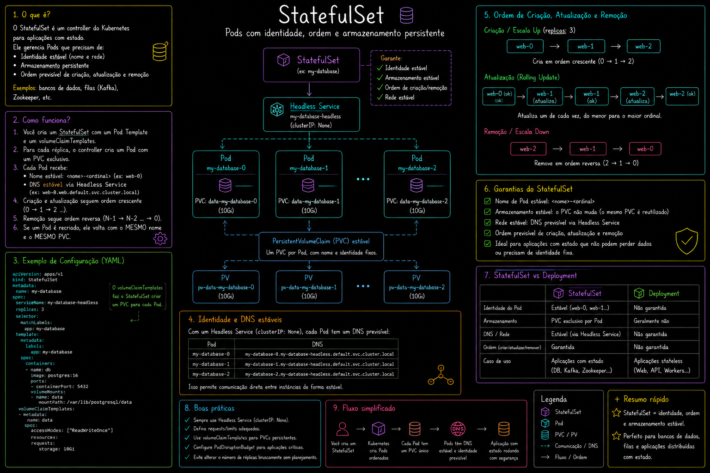
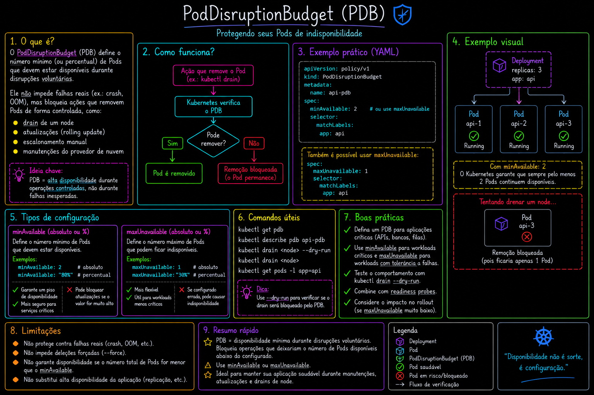

# 07 — StatefulSets

StatefulSets para workloads com identidade estável, storage por réplica e ordem de criação/deleção.

> Parte do curso [Kubernetes](../README.md).

## O que este módulo demonstra

- StatefulSet com 3 réplicas nginx
- `volumeClaimTemplates` — PVC automático por Pod (`nginx-statefulset-0`, `-1`, `-2`)
- **PodDisruptionBudget (PDB)** — limitar interrupções voluntárias durante manutenção

## Arquivos

| Arquivo | Descrição |
|---------|-----------|
| `statefulset.yaml` | StatefulSet nginx com PVC por réplica |
| `pdb.yaml` | PDB com `maxUnavailable: 0` |

## Como executar

```bash
kubectl apply -f statefulset.yaml
kubectl get statefulsets,pvc,pods
kubectl apply -f pdb.yaml
kubectl get pdb
```

Observe os nomes estáveis dos Pods: `nginx-statefulset-0`, `nginx-statefulset-1`, etc.

## Diagramas

 · 

## Próximo passo

[08-cronjobs](../08-cronjobs/) — Jobs e CronJobs para tarefas batch.
