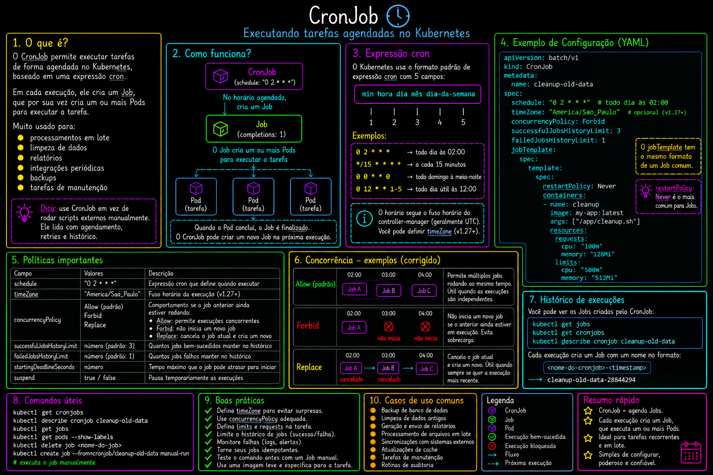

# 08 — Jobs e CronJobs

Tarefas batch pontuais (Job) e agendadas (CronJob) no Kubernetes.

> Parte do curso [Kubernetes](../README.md).

## O que este módulo demonstra

- **Job** — execução única que termina ao completar
- **CronJob** — agendamento com expressão cron (`*/1 * * * *`)
- `ttlSecondsAfterFinished` — limpeza automática de Jobs concluídos
- `restartPolicy: OnFailure` em workloads batch

## Arquivos

| Arquivo | Descrição |
|---------|-----------|
| `job.yaml` | Job simples com echo |
| `cronjob.yaml` | CronJob executando a cada minuto |

## Como executar

```bash
kubectl apply -f job.yaml
kubectl get jobs,pods
kubectl logs job/<job-name>

kubectl apply -f cronjob.yaml
kubectl get cronjobs,jobs,pods
```

## Diagrama



## Próximo passo

[09-services](../09-services/) — tipos de Service e exposição de aplicações.
