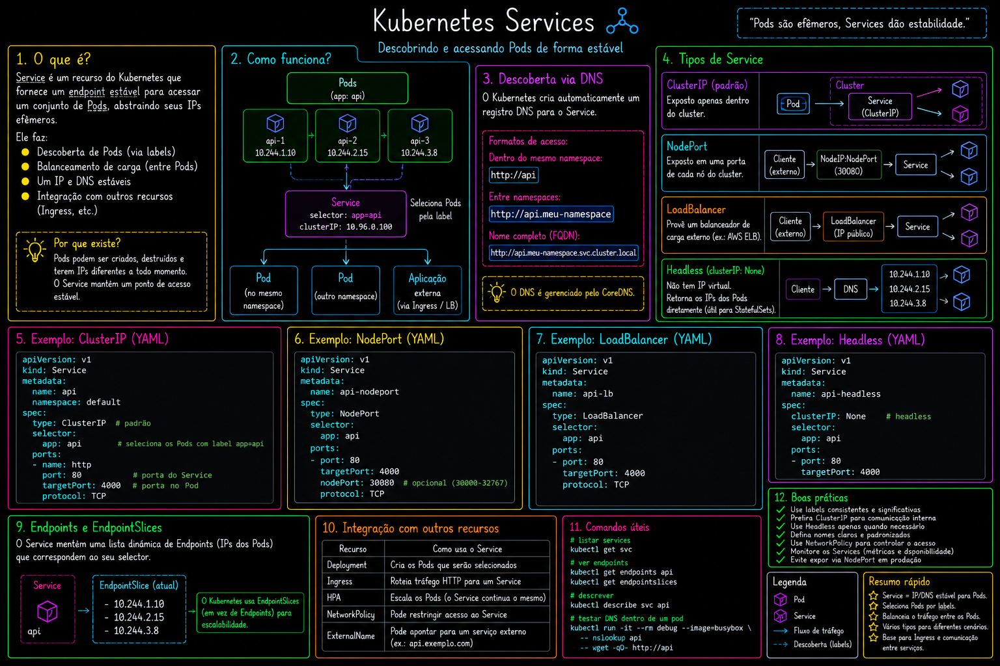
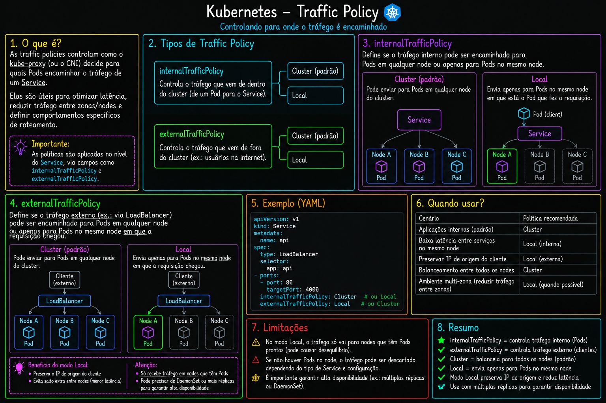

# 09 — Services

Tipos de Service no Kubernetes: ClusterIP, NodePort, LoadBalancer, Headless, ExternalName e traffic policies.

> Parte do curso [Kubernetes](../README.md).

## O que este módulo demonstra

- **ClusterIP** — IP interno estável para comunicação dentro do cluster
- **NodePort** — exposição via porta do nó
- **LoadBalancer** — IP externo (cloud ou MetalLB em bare-metal)
- **Headless** (`clusterIP: None`) — DNS direto por Pod (ideal para StatefulSets)
- **ExternalName** — alias DNS para serviço externo
- **Traffic policy** — `externalTrafficPolicy: Local` vs `Cluster`
- **MetalLB** — LoadBalancer em clusters locais/on-prem

## Arquivos

| Arquivo | Descrição |
|---------|-----------|
| `clusterip.yaml` | Service ClusterIP para nginx |
| `nodeport.yaml` | Service NodePort |
| `loadbalancer.yaml` | Service LoadBalancer básico |
| `loadbalancer-metallb.yaml` | Instalação completa do MetalLB |
| `loadbalancer-metallb-ip-pool.yaml` | IPAddressPool do MetalLB |
| `loadbalancer-traffic-policy.yaml` | `externalTrafficPolicy: Local` |
| `headless.yaml` | Headless Service (`clusterIP: None`) |
| `headless-statefulset.yaml` | StatefulSet + Headless Service |
| `external-name.yaml` | ExternalName apontando para serviço externo |

## Como executar

```bash
# Pré-requisito: Deployment nginx rodando
kubectl apply -f ../05-deployment/01-deployment.yaml

kubectl apply -f clusterip.yaml
kubectl get svc
kubectl apply -f nodeport.yaml
kubectl apply -f headless.yaml

# Headless + StatefulSet
kubectl apply -f headless-statefulset.yaml

# Testar DNS de Pod individual
kubectl run alpine-test -it --rm --image=alpine -- sh
# apk add bind-tools
# host nginx-statefulset-0.nginx-service-headless
```

Para MetalLB (cluster kind ou bare-metal):

```bash
kubectl apply -f loadbalancer-metallb.yaml
kubectl apply -f loadbalancer-metallb-ip-pool.yaml
kubectl apply -f loadbalancer.yaml
```

## Diagramas

 · 

## Próximo passo

[10-deployment-strategies](../10-deployment-strategies/) — blue-green e canary deployments.
