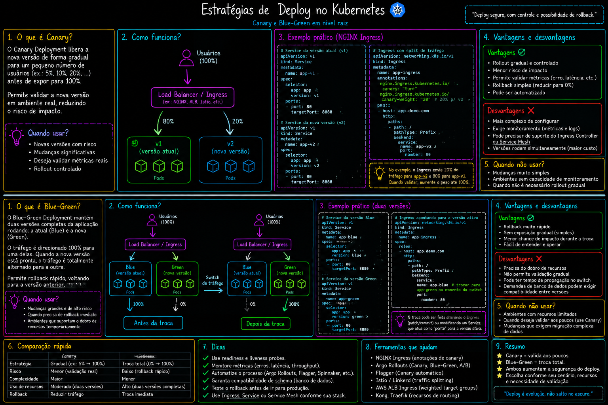

# 10 — Estratégias de deploy

Padrões de release: blue-green (troca instantânea) e canary (rollout gradual de tráfego).

> Parte do curso [Kubernetes](../README.md).

## O que este módulo demonstra

- **Blue-green** — duas versões (blue/httpd e green/nginx); troca via selector do Service
- **Canary** — versão estável (v1) com maioria das réplicas + versão nova (v2) com réplica mínima
- Services com selectors compartilhados para balanceamento entre versões

## Arquivos

| Arquivo | Descrição |
|---------|-----------|
| `blue-green-deployment.yaml` | Deployments blue (httpd) e green (nginx) |
| `blue-green-service.yaml` | Service que aponta para a versão ativa |
| `canary-deployment.yaml` | Deployments v1 (3 réplicas) e v2 (1 réplica) |
| `canary-service.yaml` | Service com selector compartilhado `app: nginx-canary` |

## Como executar

### Blue-green

```bash
kubectl apply -f blue-green-deployment.yaml
kubectl apply -f blue-green-service.yaml
kubectl get pods,svc

# Trocar tráfego: editar selector do Service de nginx-blue para nginx-green
kubectl edit svc <service-name>
```

### Canary

```bash
kubectl apply -f canary-deployment.yaml
kubectl apply -f canary-service.yaml
kubectl get pods -l app=nginx-canary -o wide
```

Com 3 réplicas v1 e 1 v2, ~25% do tráfego vai para a versão canary.

## Diagrama



## Próximo passo

[11-ingress](../11-ingress/) — roteamento HTTP/HTTPS com Ingress.
