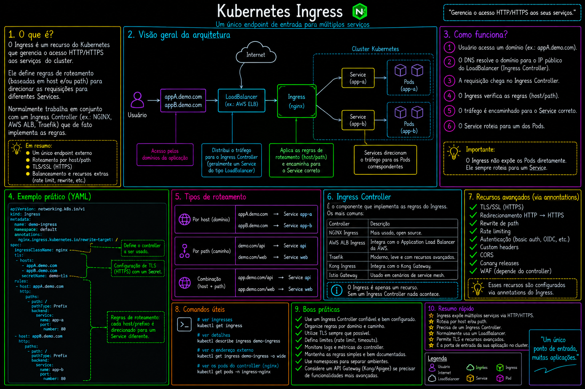

# 11 — Ingress

Roteamento HTTP/HTTPS externo para Services internos via Ingress Controller.

> Parte do curso [Kubernetes](../README.md).

## O que este módulo demonstra

- Ingress como camada L7 (paths, hosts, TLS)
- Integração com Ingress Controller (nginx-ingress, traefik, etc.)
- Pré-requisito: cluster kind com `ingress-ready=true` (ver [01-provisioning/kind](../01-provisioning/kind/))

## Status

Manifests de Ingress serão adicionados conforme o curso avança. O cluster kind já expõe as portas 80/443 no control-plane para testes locais.

## Pré-requisitos

```bash
# Cluster kind com port mappings (já configurado em 01-provisioning/kind/config.yaml)
kind create cluster --config ../01-provisioning/kind/config.yaml

# Instalar Ingress Controller (exemplo nginx-ingress)
kubectl apply -f https://raw.githubusercontent.com/kubernetes/ingress-nginx/main/deploy/static/provider/kind/deploy.yaml
```

## Diagrama



## Próximo passo

Volte ao [README principal](../README.md) ou explore o projeto integrado em [`fundamentals/06-kubernetes`](../../fundamentals/06-kubernetes/).
